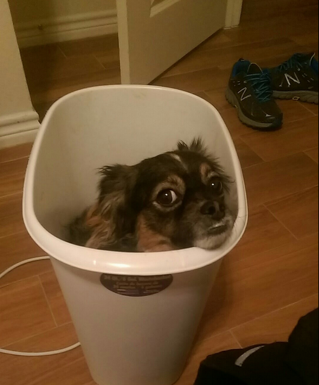
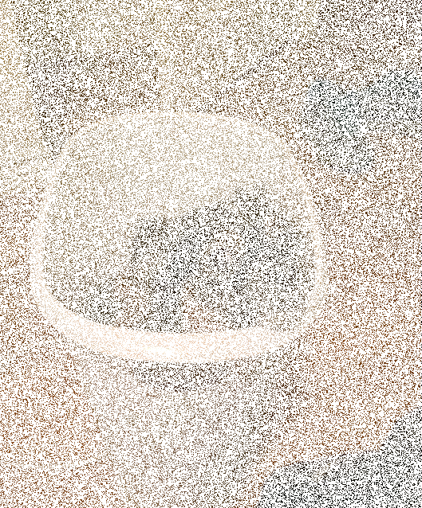
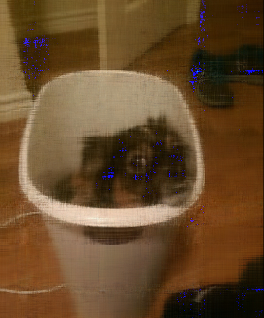

# image-matrix-completion
POC for an image recovery algorithm

This project generates a "noisy" image, and attempts to recover the original using a low-rank matrix approxipation.
This low-rank approximation is generated via ALS matrix completion. See the report in the file report.pdf for a more technical explanation on the topic.

This project can be compiled with the command `gcc -O3 matrix.c png.c -lpng -llapacke -lcblas -lomp -fopenmp -o image_completion`

The program can be run with the following commmand: `./image_completion SOURCE_IMG RANK BETA ITERATIONS THREADS OUTPUT_IMG`

From experimentation, some reasonable values to use are `(RANK = 100, BETA = 10, ITERATIONS = 30, THREADS = 3)`

Currently, this project only reads and outputs PNG images.

As this is a POC, we take in an unmodified image, such as the one below:

As part of the POC, we generate a "noisy" image that we'll run the algorithm through and try to recover the original as best we can

Here is the recovered image:

